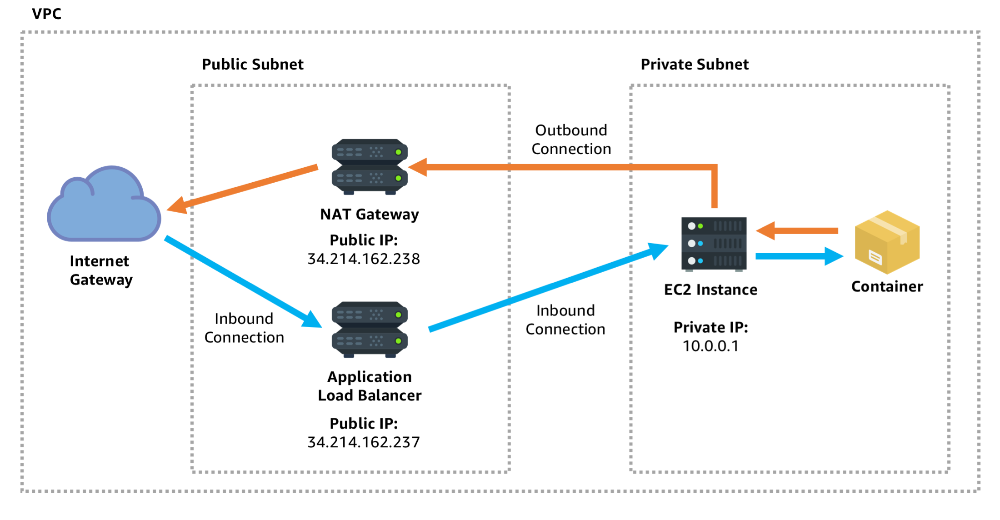

## Bring up a cloud9 IDE and run these prerequisite commands:
```
# Choose your region, and store it in this environment variable
export AWS_DEFAULT_REGION=ap-southeast-1 
echo "export AWS_DEFAULT_REGION=$AWS_DEFAULT_REGION >> ~/.bashrc"

# Install software
sudo yum -y install jq gettext
sudo curl -so /usr/local/bin/ecs-cli https://s3.amazonaws.com/amazon-ecs-cli/ecs-cli-linux-amd64-latest
sudo chmod +x /usr/local/bin/ecs-cli
```
This installs some handy text parsing utilities, and the latest ecs-cli.

## Clone this demo repository:
```
cd ~/environment
git clone https://github.com/brentley/container-demo.git
```

## Clone our application microservice repositories:
```
cd ~/environment
git clone https://github.com/brentley/ecsdemo-frontend.git
git clone https://github.com/brentley/ecsdemo-nodejs.git
git clone https://github.com/brentley/ecsdemo-crystal.git
```

## Build a VPC, ECS Cluster, and ALB:

```
cd ~/environment/container-demosdd

aws cloudformation deploy --stack-name container-demo --template-file cluster-fargate-private-vpc.yml --capabilities CAPABILITY_IAM
aws cloudformation deploy --stack-name container-demo-alb --template-file alb-external.yml
```
At a high level, we are building what you see in the diagram. We will have 3 
availability zones, each with a public and private subnet. The public subnets
will hold service endpoints, and the private subnets will be where our workloads run.
Where the image shows an instance, we will have containers on AWS Fargate.

## Set environment variables from our build
```

export clustername=$(aws cloudformation describe-stacks --stack-name container-demo --query 'Stacks[0].Outputs[?OutputKey==`ClusterName`].OutputValue' --output text)
export target_group_arn=$(aws cloudformation describe-stack-resources --stack-name container-demo-alb | jq -r '.[][] | select(.ResourceType=="AWS::ElasticLoadBalancingV2::TargetGroup").PhysicalResourceId')
export vpc=$(aws cloudformation describe-stacks --stack-name container-demo --query 'Stacks[0].Outputs[?OutputKey==`VpcId`].OutputValue' --output text)
export ecsTaskExecutionRole=$(aws cloudformation describe-stacks --stack-name container-demo --query 'Stacks[0].Outputs[?OutputKey==`ECSTaskExecutionRole`].OutputValue' --output text)
export subnet_1=$(aws cloudformation describe-stacks --stack-name container-demo --query 'Stacks[0].Outputs[?OutputKey==`PrivateSubnetOne`].OutputValue' --output text)
export subnet_2=$(aws cloudformation describe-stacks --stack-name container-demo --query 'Stacks[0].Outputs[?OutputKey==`PrivateSubnetTwo`].OutputValue' --output text)
export subnet_3=$(aws cloudformation describe-stacks --stack-name container-demo --query 'Stacks[0].Outputs[?OutputKey==`PrivateSubnetThree`].OutputValue' --output text)
export security_group=$(aws cloudformation describe-stacks --stack-name container-demo --query 'Stacks[0].Outputs[?OutputKey==`ContainerSecurityGroup`].OutputValue' --output text)

cd ~/environment
```
This creates our infrastructure, and sets several environment variables we will use to
automate deploys.

## Configure `ecs-cli` to talk to your cluster:
```
ecs-cli configure --region $AWS_DEFAULT_REGION --cluster $clustername --default-launch-type FARGATE --config-name container-demo
```
We set a default region so we can reference the region when we run our commands.


## Authorize traffic:
```
aws ec2 authorize-security-group-ingress --group-id "$security_group" --protocol tcp --port 3000 --cidr 0.0.0.0/0
```
We know that our containers talk on port 3000, so authorize that traffic on our security group:

## Deploy our frontend application:
```
cd ~/environment/ecsdemo-frontend
envsubst < ecs-params.yml.template >ecs-params.yml

ecs-cli compose --project-name ecsdemo-frontend service up \
    --create-log-groups \
    --target-group-arn $target_group_arn \
    --private-dns-namespace service \
    --enable-service-discovery \
    --container-name ecsdemo-frontend \
    --container-port 3000 \
    --cluster-config container-demo \
    --vpc $vpc
    
```
Here, we change directories into our frontend application code directory.
The `envsubst` command templates our `ecs-params.yml` file with our current values.
We then launch our frontend service on our ECS cluster (with a default launchtype 
of Fargate)

Note: ecs-cli will take care of building our private dns namespace for service discovery,
and log group in cloudwatch logs.

## View running container:
```
ecs-cli compose --project-name ecsdemo-frontend service ps \
    --cluster-config container-demo
```
We should have one task registered.

## Check reachability (open url in your browser):
```
alb_url=$(aws cloudformation describe-stacks --stack-name container-demo-alb --query 'Stacks[0].Outputs[?OutputKey==`ExternalUrl`].OutputValue' --output text)
echo "Open $alb_url in your browser"
```
This command looks up the URL for our ingress ALB, and outputs it. You should 
be able to click to open, or copy-paste into your browser.

## View logs:
```
#substitute your task id from the ps command 
ecs-cli logs --task-id a06a6642-12c5-4006-b1d1-033994580605 \
    --follow --cluster-config container-demo
```
To view logs, find the task id from the earlier `ps` command, and use it in this
command. You can follow a task's logs also.

## Scale the tasks:
```
ecs-cli compose --project-name ecsdemo-frontend service scale 3 \
    --cluster-config container-demo
ecs-cli compose --project-name ecsdemo-frontend service ps \
    --cluster-config container-demo
```
We can see that our containers have now been evenly distributed across all 3 of our
availability zones.

## Bring up NodeJS backend api:
```
cd ~/environment/ecsdemo-nodejs
envsubst <ecs-params.yml.template >ecs-params.yml
ecs-cli compose --project-name ecsdemo-nodejs service up \
    --create-log-groups \
    --private-dns-namespace service \
    --enable-service-discovery \
    --cluster-config container-demo \
    --vpc $vpc

```
Just like earlier, we are now bringing up one of our backend API services.
This service is not registered with any ALB, and instead is only reachable by 
private IP in the VPC, so we will use service discovery to talk to it.

## Scale the tasks:
```
ecs-cli compose --project-name ecsdemo-nodejs service scale 3 \
    --cluster-config container-demo
    
```
We can see that our containers have now been evenly distributed across all 3 of our
availability zones.

## Bring up Crystal backend api:
```
cd ~/environment/ecsdemo-crystal
envsubst <ecs-params.yml.template >ecs-params.yml
ecs-cli compose --project-name ecsdemo-crystal service up \
    --create-log-groups \
    --private-dns-namespace service \
    --enable-service-discovery \
    --cluster-config container-demo \
    --vpc $vpc

```
Just like earlier, we are now bringing up one of our backend API services.
This service is not registered with any ALB, and instead is only reachable by 
private IP in the VPC, so we will use service discovery to talk to it.

## Scale the tasks:
```
ecs-cli compose --project-name ecsdemo-crystal service scale 3 \
    --cluster-config container-demo
    
```
We can see that our containers have now been evenly distributed across all 3 of our
availability zones.

## Conclusion:
You should now have 3 services, each running 3 tasks, spread across 3 availability zones.
Additionally you should have zero instances to manage. :)

## Cleanup:
```
cd ~/environment/ecsdemo-frontend
ecs-cli compose --project-name ecsdemo-frontend service down --cluster-config container-demo
cd ~/environment/ecsdemo-nodejs
ecs-cli compose --project-name ecsdemo-nodejs service down --cluster-config container-demo
cd ~/environment/ecsdemo-crystal
ecs-cli compose --project-name ecsdemo-crystal service down --cluster-config container-demo

ecs-cli down --force --cluster-config container-demo
aws cloudformation delete-stack --stack-name container-demo-alb
aws cloudformation wait stack-delete-complete --stack-name container-demo-alb
aws cloudformation delete-stack --stack-name container-demo
aws cloudformation delete-stack --stack-name amazon-ecs-cli-setup-private-dns-namespace-$clustername-ecsdemo-frontend
```


